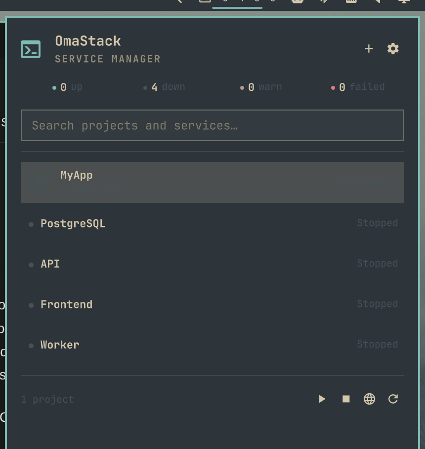

# OmaStack

**Your local development stack, one click away.**

OmaStack is a native Omarchy Quattro shell plugin for defining, supervising,
monitoring and opening local development services. Its compact bar status,
narrow keyboard-friendly panel and persistent backend follow the active
Omarchy theme automatically. The main interface is QML/Quickshell—there is no
Electron app, browser wrapper or standalone GTK dashboard.



## Current capabilities

- Project and service create/edit/duplicate/reorder/delete workflows.
- Executable-plus-argument commands, explicit shell mode, working directory,
  environment and mode-`0600` secret storage.
- Persistent `systemd --user` units with dependency ordering, reverse shutdown,
  restart policies, stop signals, graceful timeout and force-kill.
- Reconciliation across shell and backend restarts using stable UUIDs.
- CPU, memory, PID, uptime, exit details, bounded history and detected TCP ports.
- HTTP(S), TCP and executable health checks with deadlines, retries, grace
  periods, bounded concurrency and transition notifications.
- Journald stdout/stderr, per-service or merged project logs, search,
  pause/resume, selectable output and non-destructive visible-buffer clearing.
- Optional visual Docker Compose discovery/import, lifecycle, rebuild/recreate,
  container terminal, state, health, published ports and Docker stats.
- Loopback HTTP reverse proxy, `.localhost`/`.test` routes, duplicate/port
  conflict detection and one-click opening.
- Same-user Unix-socket API, shell IPC, CLI, doctor, cleanup and validated
  configuration backup/restore.

Managed commands inherit a small baseline of execution/session variables such
as `PATH`, locale, XDG, display and D-Bus values. Application credentials and
tool-specific variables are not copied from the user manager automatically;
define them explicitly in the service editor or a private environment file.

Automatic `.test` DNS and trusted local HTTPS are deliberately deferred. The
current release makes no privileged change and rejects HTTPS routes rather
than presenting incomplete security as finished. See
[Privileged operations](docs/privileged-operations.md).

## Requirements

OmaStack targets Omarchy Quattro on Arch Linux/Hyprland. Building requires Go
1.25.13 or newer. Runtime requirements and optional Docker tools are listed in
[docs/dependencies.md](docs/dependencies.md).

## Build and install

```bash
omarchy pkg add go
./scripts/install-local.sh
```

The installer builds/tests the binary, validates the manifest, copies the
plugin to `~/.config/omarchy/plugins/david.omastack/`, installs user-level
systemd units and enables the bar widget. It never modifies
`/usr/share/omarchy/` and never uses root.

For a published repository install, copy its HTTPS or SSH Git URL and use:

```bash
read -rp "OmaStack Git URL: " omastack_repository
omarchy plugin add "$omastack_repository" --enable
cd "${XDG_CONFIG_HOME:-$HOME/.config}/omarchy/plugins/david.omastack"
./scripts/build.sh
./bin/omastack setup
```

User projects live under `~/.config/omastack/`, outside the plugin checkout, so
`omarchy plugin update david.omastack` cannot overwrite them.

## Everyday use

Click the OmaStack bar widget or run `omastack open`. Press `/` to focus search.
Tab moves through native controls, Enter/Space activates them and Escape closes
the log view or panel. Click a project to expand it; click a service for inline
metrics, or right-click it to edit.

For a running web service, hover or keyboard-focus its row and press the globe
button. OmaStack opens the service's configured URL, or falls back to the first
detected host/Docker port at `http://127.0.0.1:<port>`. Set an exact URL on the
service editor's **Web** tab when the app uses a specific path, hostname or
HTTPS.

The bar shows four small counts—running, stopped, unhealthy and crashed—next to
the icon by default. Open the panel's gear menu and switch off **Appearance →
Show four bar counts**, or use:

```bash
omarchy bar set david.omastack showStatusCounts false --json
```

```bash
omastack list
omastack status --json
omastack start MyApp
omastack stop MyApp/API
omastack restart 33333333-3333-4333-8333-333333333333
omastack logs MyApp --follow
omastack docker rebuild 22222222-2222-4222-8222-222222222222
omastack doctor
omastack cleanup
omastack export
omastack import ~/.config/omastack/exports/omastack-backup-….json --replace
```

Shell IPC can be used from keybindings and scripts:

```bash
omarchy-shell shell summon david.omastack '{}'
omarchy-shell david.omastack status
omarchy-shell david.omastack start 'MyApp/API'
omarchy-shell david.omastack stopAll
```

The first command uses the supported shell summon route. The remaining calls
target OmaStack's persistent QML `IpcHandler`; `omastack open/start/stop` is the
stable backend automation interface even while the shell is reloading.

## Example project

[examples/full-stack/config.json](examples/full-stack/config.json) contains a
frontend, API, PostgreSQL Compose service and worker, including dependencies,
health checks, secrets, routes and restart policies. Replace its illustrative
`/home/example` paths and password before importing.

## Update, disable, remove and purge

```bash
omarchy plugin update david.omastack
./scripts/build.sh && ./bin/omastack setup

omarchy plugin disable david.omastack    # definitions and managed units remain
omastack uninstall                       # stops/removes units; definitions remain
omarchy plugin remove david.omastack

omastack uninstall --purge               # interactive: type PURGE
```

`--purge --yes` exists for explicit non-interactive automation. Purge removes
only validated XDG directories whose basename is exactly `omastack`; it refuses
symlink targets. See [docs/storage.md](docs/storage.md) for every path.

## Development and verification

```bash
go test ./...
go test -race ./...
go vet ./...
go test -coverprofile=coverage.out ./...
go tool cover -func=coverage.out
staticcheck ./...
govulncheck ./...
shellcheck scripts/*.sh
go build -buildvcs=false -trimpath ./cmd/omastack
omarchy plugin validate .
```

To create a reproducible source release from committed files only:

```bash
./scripts/package.sh
```

The resulting archive and SHA-256 file are written under `dist/`. Ignored build
outputs—including `./omastack` and `bin/omastack`—cannot enter this archive.

The acceptance record is in [docs/testing.md](docs/testing.md). Architecture,
security and reference research live in:

- [Architecture](docs/architecture.md)
- [Threat model](docs/threat-model.md)
- [Design review and three-theme captures](docs/design-review.md)
- [CMDHub reference research](docs/cmdhub-reference.md)
- [CMDHub-to-OmaStack mapping](docs/cmdhub-to-omastack.md)
- [Third-party notices](docs/THIRD_PARTY_NOTICES.md)

## Reference and originality

OmaStack studied CMDHub's public MIT-licensed product and repository at commit
`8e8615e1d95742ad706d52d1075e03fc2d6dab2c` to understand service-management
information architecture and workflows. OmaStack does not contain CMDHub source
code, branding, logo, wording, screenshots, fonts or branded assets. Its QML,
Go implementation and Omarchy-native panel are original. Full attribution
and licence notes are included in the reference and third-party documents.

## Licence

MIT. See [LICENSE](LICENSE).
