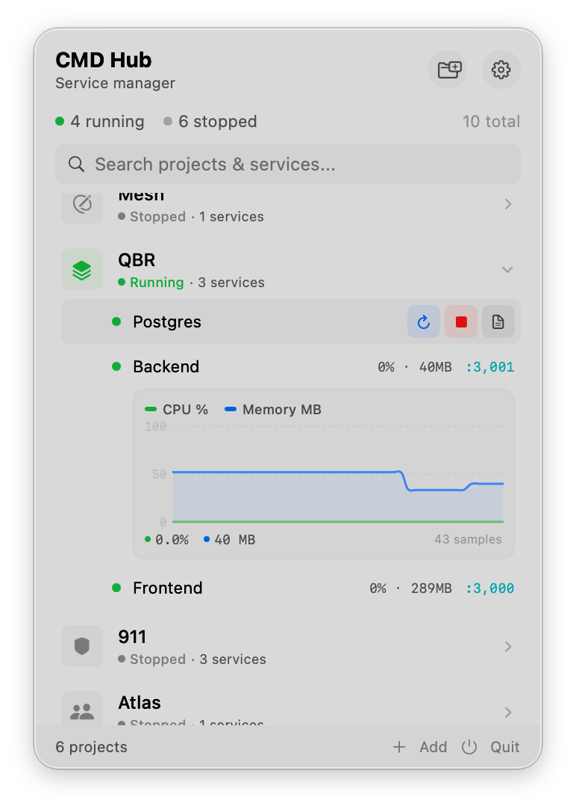
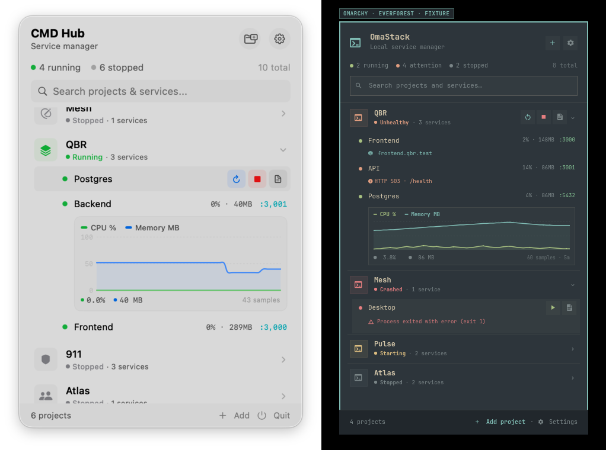
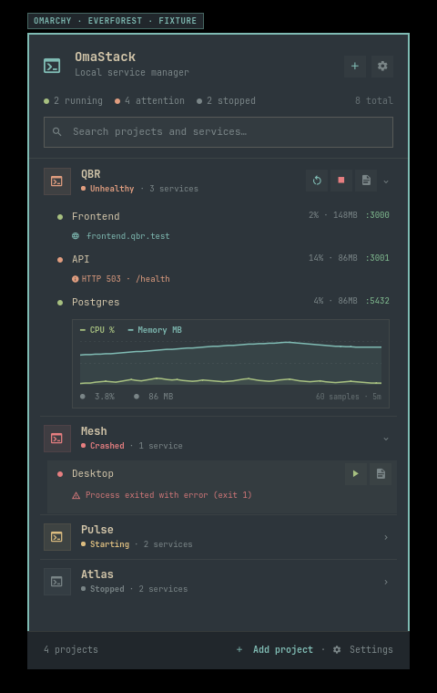
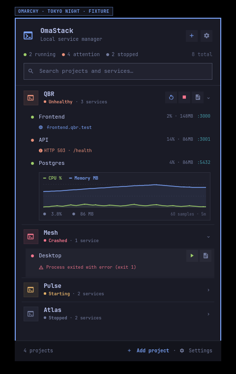
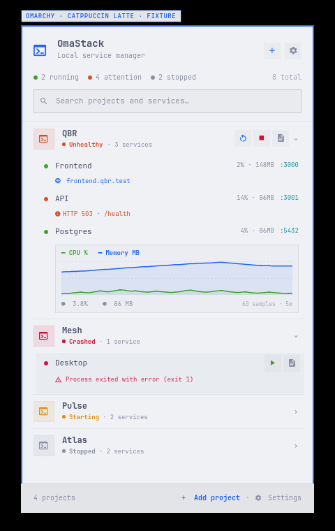

# CMDHub reference study and OmaStack design gate

Research date: 2026-08-31

Reference product: [CMDHub](https://cmdhub.link/)

Reference repository: [icyberon/cmdhub](https://github.com/icyberon/cmdhub)

Pinned tag: `v1.0.0`

Pinned commit: [`8e8615e1d95742ad706d52d1075e03fc2d6dab2c`](https://github.com/icyberon/cmdhub/commit/8e8615e1d95742ad706d52d1075e03fc2d6dab2c)

Commit date: 2026-03-18T01:38:14+04:00

Commit subject: `Initial Release 1.0`
Licence: MIT, Copyright (c) 2026 Vahagn Mkrtchyan

## Decision summary

OmaStack should copy CMDHub's proven information architecture, not its macOS chrome:

- one compact top-bar panel is the daily control surface;
- projects are the primary grouping and expand in place;
- services are dense single-line rows with state, metrics, ports and actions;
- the chart is an optional detail inside the service row, not a dashboard card;
- logs and project/service editing open into larger dedicated surfaces;
- global configuration and privileged networking remain separate from routine lifecycle controls.

The Omarchy translation should be a native Quickshell/QML bar widget and popup using Omarchy's live palette, `monospace` font alias, spacing scale, borders, zero-radius default geometry and keyboard-panel conventions. The visual target is “CMDHub's density and hierarchy, expressed by Omarchy,” not a macOS facsimile and not a web admin dashboard.

## Reference provenance and research coverage

The repository was cloned from `https://github.com/icyberon/cmdhub.git` with a shallow checkout. `git rev-parse HEAD` and the `v1.0.0` tag both resolve to the pinned commit above.

Read in the pinned source:

- `README.md` and `LICENSE`;
- every model in `CMDHub/Models`;
- app composition and menu-bar/window routing in `CMDHubApp.swift`;
- popover, project row, service row, metrics chart and port picker views;
- project wizard, service editor, icon picker and their view model;
- settings and proxy settings;
- project log window, log content, terminal input and log view model;
- process, PTY, dependency, environment, health, resource, port, file-watch and log-store implementations;
- configuration persistence and popover state aggregation;
- proxy route coordination, SSL management, XPC protocol, privileged helper, code-sign validation, resolver file management, DNS responder, HTTP parser and reverse proxy.

Browsed on the live website:

- the full landing page and its interactive hero mock-up;
- all six feature demonstrations: lifecycle, monitoring, health checks, reverse proxy, DNS and logs;
- the problem, workflow and infrastructure sections;
- the port-discovery demonstration;
- all published documentation pages: Getting Started, Services, Health Checks, Reverse Proxy, SSL Certificates, DNS, Configuration and Troubleshooting.

The live landing-page mock-up and pinned screenshot were revisited after the
first OmaStack UI pass. That recheck rejected the initial two-pane workbench:
CMDHub's daily surface is decisively a narrow disclosure list, while wider
surfaces are reserved for logs and editing. The installed Omarchy Agents/Codex
usage panel was then used to calibrate the native panel proportions.

The live landing page currently exposes no video assets. Its product demonstration is rendered from HTML and 34 inline SVG illustrations. The only repository product screenshot is `.github/screenshot.png`; it is 772×1082 and its SHA-256 is `35e8012e40d7697b13c28f3f916db859997f74dd5e21f074b2de3ff3c59e3599`.



### Authority order

Where sources disagree, this study uses the following order:

1. pinned source code and actual data model;
2. pinned repository screenshot;
3. live landing-page demonstration;
4. published prose documentation.

This matters because the public docs have drifted from the pinned implementation. The discrepancies are recorded below instead of silently treating planned behavior as shipped behavior.

## CMDHub visual-reference summary

### Overall grammar

- The primary surface is a narrow `340`-point SwiftUI popover.
- The hierarchy is header → global counts → search → vertically grouped projects → compact footer.
- Side padding is consistently `14`; list density is based on roughly `44`-point project headers and `28`-point service rows.
- Most controls are hidden until hover. Idle rows prioritize names, state, CPU, memory, ports and domain information.
- Status is redundant by design: color dot, state label at project level, and error copy when crashed.
- Project icons use a small status-tinted square; services use a `6`-point status dot.
- Charts expand under the selected service without leaving the project context.
- Low-contrast surface fills and hairline borders carry structure; there are no dashboard-sized cards or oversized statistics.

### Source-derived proportions and typography

| Element | CMDHub source value | OmaStack translation |
|---|---:|---|
| Popover width | `340` | Standard Omarchy companion-panel content width `380` on every surface |
| Header padding | `14` horizontal, `12` vertical | `Style.spacing.panelPadding` with compact internal gaps |
| Header title | 14 bold | `Style.font.title`, bold |
| Header subtitle | 10 | `Style.font.caption` |
| Global counters | 11 | `Style.font.bodySmall` |
| Search | 12, 6 radius | native `TextField`, current Omarchy radius (default `0`) |
| Project header | approximately 44 | `42` at the default font scale |
| Project icon | 28 square, 6 radius | 28 square, Omarchy current radius |
| Service row | approximately 28 | `38`, or `52` when an error line is present |
| Service name | 11 | `Style.font.bodySmall` |
| Metrics/ports | 9 monospaced | `Style.font.caption`, Omarchy active font |
| Chart plot | 64 high | Two `42`-high CPU/memory sparklines in the expanded row |
| Inline action | 22 square, 5 radius | native `PanelActionButton` geometry and state tokens |

OmaStack must use Omarchy's active `monospace` alias. On the research system it resolves to **JetBrainsMono Nerd Font**. It must not bundle or pin a macOS system font.

## Screen and component inventory

### 1. Top-bar entry and main panel

| Component | Layout and content | Behaviour |
|---|---|---|
| Bar widget | OmaStack glyph plus compact aggregate state | Click toggles the anchored panel; urgent/crash state may use the bar active/urgent role; keyboard focus uses Omarchy conventions |
| Header | product name, “Service manager”, add-project and settings actions | Add opens project wizard; settings opens a separate settings surface |
| Global status | running dot/count, stopped dot/count, total at trailing edge | Four compact running, stopped, unhealthy and crashed counts; the same four numbers are optionally shown beside the bar icon |
| Search | icon, placeholder, clear affordance | Case-insensitive project/service filtering; a matching project shows all its services |
| Project list | scrollable, dynamic height, capped in CMDHub at `520` | Expanded/collapsed in place; panel height follows content and the list caps at `390` |
| Footer | project count, add, quit | Project count plus start-all, stop-all, routes and refresh; add remains in the header and dismissal is outside-click/Escape |

### 2. Project groups

Each project header contains:

- a status-tinted project icon tile;
- project name;
- aggregate status dot and label;
- service count;
- hover-only project lifecycle controls;
- expand/collapse chevron.

Aggregate priority in the source is crashed → unhealthy → transitioning → all-running → all-stopped → mixed treated as running. OmaStack should preserve the order but label mixed groups as `Partial` to avoid saying a partly stopped project is fully running.

Project interactions:

- click header to expand/collapse;
- hover for Start all or Restart all/Stop all and project logs;
- context menu for edit, move and delete;
- drag reorder, temporarily collapsing the dragged project;
- delete first requests confirmation in OmaStack, then stops managed services before removal.

### 3. Service rows and state inventory

| State | Visual treatment | Available controls | Detail |
|---|---|---|---|
| Running | green dot; metrics and ports visible | Restart, Stop, Logs | Chart can expand; proxy domain and default marker can appear |
| Stopped | muted/grey dot | Start, Logs | No live metrics or ports |
| Starting | yellow dot plus progress indicator | Logs | Preserve prior metrics only if explicitly marked stale; otherwise hide |
| Stopping | yellow dot plus progress indicator | Logs | Lifecycle actions disabled until completion |
| Unhealthy | orange dot; process still treated as running | Restart, Stop, Logs | Health badge and failing check summary should be visible; metrics/ports remain available |
| Crashed | red dot and one- or two-line last-error message | Start, Logs | Error examples include exit 1, 126, 127, signal and arbitrary exit code |

The source exposes service actions on hover and equivalent context-menu actions. Clicking the body toggles the chart; logs are opened from the document icon or context menu. This is more precise than the docs' statement that clicking a running service opens logs.

### 4. Metrics and sparklines

CMDHub samples a whole process tree by recursively finding child PIDs and summing `ps` CPU and RSS values. Port discovery scans the process tree with `lsof`.

The chart implementation uses:

- separate CPU percent and memory MB series on one automatically scaled y-axis;
- a default `60`-sample ring buffer;
- a default `5`-second sampling interval, therefore a five-minute window;
- Catmull–Rom interpolation;
- `1.5`-point lines;
- an `8%` opacity area fill for each series;
- hidden x-axis;
- three approximate y-axis marks, dashed `0.5`-point grid lines and compact monospaced labels;
- a `64`-point plot height;
- a legend above and current CPU/memory values plus sample count below.

OmaStack QML requirements:

- fixed 60-sample circular histories per service;
- default five-second backend sampling and five-minute visible window;
- a cheap `Canvas` path that is rebuilt only when the series changes;
- CPU and memory lines using theme semantic roles, not hard-coded green/blue alone;
- low-alpha fills and grid lines derived from popup text/background roles;
- compact current-value labels, with the expanded row acting as the detail view;
- stop repaint timers and chart animation while the panel is closed;
- no unbounded JavaScript arrays or per-frame sampling.

### 5. Ports, domains and health

- Running services show up to three teal monospaced `:port` labels; if more than three exist, CMDHub shows two plus a “+N more” summary.
- Clicking a port copies it in CMDHub. OmaStack should also provide an explicit tooltip and keyboard copy action.
- A proxy-enabled service may show a domain/globe action and a green default-service star.
- Multiple auto-detected ports produce an orange selection badge and a 240-wide picker with Cancel/Apply.
- Health checks are HTTP 2xx, TCP connect, or shell exit `0`.
- The source uses a fixed five-second timeout and a three-failure threshold before entering unhealthy; success restores running.
- The source does not retain or display a per-check latency/history badge, so any such detail in OmaStack is an additive Linux-native improvement.

### 6. Log viewer

CMDHub opens a resizable project log window (`900×550`) with:

- a `160–260`-wide service sidebar and status dots;
- a selected service detail;
- a search field, filtered-line count, auto-scroll toggle, clear and export toolbar actions;
- timestamped monospaced output with text selection;
- a ring buffer, default `10,000` lines;
- live PTY input for running services;
- Enter to submit, Up/Down history, Tab completion and Ctrl+C interrupt;
- one window per project, reselecting a service in the existing window when requested.

OmaStack should render this as a native Quickshell window or dedicated QML app window, not squeeze it into the bar panel. Journald/captured PTY output should keep source tags and structured timestamps. Clear must clear only OmaStack's view buffer unless the user explicitly confirms deleting persisted logs.

### 7. Project and service wizard

Project wizard (`540×520`):

- name, icon and root directory;
- optional project reverse-proxy domain and default service;
- service count and ordered service list;
- per-service health/dependency markers;
- add, edit, delete and reorder;
- Create/Save disabled until name and root are present;
- save-time duplicate-domain and dependency-cycle validation;
- alert on validation/save failure.

Service editor (`480×540`):

- Basics: name, command, working directory and shell;
- Environment: optional `.env` path and repeatable `KEY = VALUE` rows;
- Dependencies: toggles for other services;
- Health Check: segmented None/HTTP/TCP Port/Command selection and type-specific fields;
- Watchdog: restart on file change and additional ignore globs;
- Proxy Settings: inclusion, subdomain and explicit/auto-detected port;
- Cancel and Add/Save actions.

OmaStack replaces SF Symbols with a searchable curated Nerd Font icon set and previews the actual current font glyph. Directory selection must use a native file dialog or portal.

### 8. Settings, empty, loading, error and confirmation states

Settings screens in CMDHub:

- General: launch at login, Dock visibility, appearance, default shell, health interval, resource interval and log buffer size;
- Proxy: helper installed/approval/not-installed/checking, enable proxy, TLD list, SSL, CA state and active-route status;
- About.

Required OmaStack state inventory:

| State | Proposed treatment |
|---|---|
| Empty first run | centered folder-plus glyph, “No projects yet,” primary Add Project action |
| Empty search | search glyph and the exact query in “No results for …” |
| Initial loading | fixed skeleton rows or a compact spinner; do not jump panel width/height |
| Backend unavailable | persistent urgent banner with Retry and View diagnostics |
| Corrupt config | warning banner; preserve and reveal backup path instead of silently replacing only |
| Action failure | row-local failure plus logs; retain crashed/unhealthy state |
| Privileged helper pending | settings-only approval status; routine panel remains usable |
| Delete confirmation | Omarchy `ConfirmDialog`, destructive color, exact project/service name |
| Stop all confirmation | only when unmanaged dependents or destructive side effects are detected |
| Port conflict | row/settings error naming the occupied port and owning process when available |

## Interaction flow

```text
Top-bar widget
  └─ Main panel
      ├─ Search/filter
      ├─ Project header ── expand/collapse
      │   ├─ Start all / Restart all / Stop all
      │   └─ Service row
      │       ├─ Start / Restart / Stop
      │       ├─ Toggle chart
      │       ├─ Copy/open port or local domain
      │       └─ Open project log window on this service
      ├─ Add/Edit project ── project wizard
      │   └─ Add/Edit service ── service editor
      └─ Settings
          ├─ General and monitoring
          ├─ Reverse proxy / DNS / certificates
          └─ Backend/helper diagnostics
```

Keyboard expectations inherited from Omarchy:

- Escape/outside click closes the panel;
- arrow keys move the panel cursor through projects/services;
- Left/Right collapses/expands or changes a focused compact control;
- Enter activates the focused row/action;
- Tab moves among actionable controls and can switch adjacent bar panels where supported;
- `/` or Ctrl+F focuses search;
- destructive actions always expose a confirmation path and remain accessible without hover.

## Source architecture summary

### Process and monitoring

- `ProcessManager` owns state and coordinates PTY process lifecycle.
- `PTYProcess` uses `forkpty`, creates a process group, streams bytes from the PTY and terminates the group with SIGTERM then SIGKILL after five seconds.
- `EnvironmentLoader` merges inherited environment → `.env` values → inline service values; configured shell startup then supplies shell-profile paths.
- `DependencyResolver` uses Kahn topological sorting and reverses the result for stop order.
- `HealthMonitor` runs HTTP, TCP or shell checks, applies a five-second timeout and requires three consecutive failures.
- `ResourceMonitor` samples the recursive process tree with `ps`; `MetricsHistory` retains 60 entries.
- `PortMonitor` scans listening ports with `lsof`.
- `FileWatchMonitor` uses FSEvents, `.gitignore` rules and a 500ms debounce before restart.
- `LogStore` is a thread-safe line ring buffer with partial-line handling and separate input/output source markers.

### Persistence

- Data lives in `~/.cmdhub/config.json` with mode `0600`.
- Saves use a temporary file and move it into place.
- Models contain projects, services, shell selection, environment, dependencies, health checks, watchdog, proxy settings and global intervals.
- Decode failures reset to an empty config and surface a dismissible warning.

### Privileged helper and networking

- The GUI registers a privileged `SMAppService` daemon and connects over a privileged Mach/XPC service.
- The helper validates the connecting process' code signature, Team ID and bundle ID before accepting the connection; debug builds relax validation.
- Its XPC API starts/stops HTTP(S) proxy and DNS, manages routes/domains/TLDs, writes `/etc/resolver/<tld>` and trusts a CA certificate.
- The helper binds ports 80/443 itself, runs a UDP DNS responder on `127.0.0.1:15353`, and maintains active/inactive routes.
- The proxy resolves hosts by TLD, serves an offline page for inactive routes, provides a health endpoint for auto-refresh, and otherwise pipes TCP streams to the upstream port.
- SSL uses OpenSSL-generated CA/wildcard material and Security framework trust settings.

## Published-docs versus pinned-source discrepancies

These are reference caveats, not OmaStack requirements:

| Published claim | Pinned-source behaviour |
|---|---|
| macOS 14+ | README/project are macOS 26/Xcode 26 |
| per-health-check interval and timeout | models store only check target; global interval and fixed five-second timeout |
| start waits for dependency health | start loop uses dependency order with a 100ms delay, not a health gate |
| dependency crash stops dependents | no such cascade is present in `ProcessManager` |
| service is “starting” until first health success | process becomes running immediately after spawn; monitor can later mark unhealthy |
| click service opens logs | service-row click toggles chart; logs use an action/context item |
| per-project wildcard certificates in `~/.cmdhub/certs` | source uses `~/.cmdhub/ssl` and wildcard per TLD |
| three CA trust states | UI checks generated/not-generated, not actual trust state |
| helper forwards to an unprivileged app listener | helper contains and runs proxy/DNS servers itself |
| config keys such as `globalProxySettings`, `env`, `envFile`, top-level port/subdomain | Codable source uses `proxySettings`, `environmentVariables`, `envFilePath` and nested proxy configs |

OmaStack specifications must be generated from its own schema and verified backend behavior so this kind of drift does not become part of the interface contract.

## CMDHub-to-OmaStack feature mapping

| CMDHub | OmaStack | Adaptation |
|---|---|---|
| `MenuBarExtra` popover | Omarchy bar widget + `PopupWindow`/keyboard panel | Anchor below the top bar; follow bar position and multi-monitor ownership |
| SwiftUI environment/view models | QML view model over local D-Bus/IPC | UI never owns or shells privileged process logic |
| Project disclosure rows | QML project delegates | Same grouping, density, aggregate status and hover/keyboard actions |
| Service rows | QML compact delegates | Same state/metric/port hierarchy; add explicit health badge and partial-project label |
| Swift Charts | QML Canvas/scene graph | Same five-minute/60-sample concept, 64px plot, dual series and bounded memory |
| `forkpty` process groups | supervised Linux backend, preferably systemd user scopes/transient units or a dedicated daemon using process groups/cgroups | Survives panel reloads and exposes reliable state/metrics |
| `ps` process-tree metrics | cgroup v2 / `/proc` aggregation | More reliable per-service CPU/memory accounting |
| `lsof` ports | inet_diag/netlink or `ss` backend | Avoid periodic shell parsing in QML |
| FSEvents watchdog | inotify/fanotify backend | Respect `.gitignore` and debounce |
| SwiftUI log window | native QML window | Preserve sidebar, toolbar, ring buffer, PTY input and export |
| Project/service wizard | native QML modal/window | Use portal file picker and Nerd Font icon picker |
| `~/.cmdhub/config.json` | `$XDG_CONFIG_HOME/omastack/config.json` | `0600`, atomic write, versioned schema and recoverable backup |
| User notifications | freedesktop notification through Omarchy/desktop portal | Crash/unhealthy actions link to logs |
| XPC privileged helper | narrowly scoped root service + D-Bus/polkit | Package-time identity, authorization rules, strict input validation and no general command execution |
| `/etc/resolver` DNS | systemd-resolved/NetworkManager integration or packaged local resolver | `.test` only by default; explicit approval for system changes |
| Keychain CA trust | Arch trust store plus browser-specific guidance | Never silently modify Firefox/NSS; display verified trust state |
| SF Symbols | Nerd Font glyphs | Use current Omarchy font; never copy CMDHub icon/logo assets |

## Proposed OmaStack wireframes

### Main top-bar panel

```text
┌──────────────────────────────────────────┐
│ 󰆍  OmaStack                     󰐕   󰒓 │
│     Local service manager                │
│                                          │
│ ● 4 running   ◐ 1 attention   ○ 3 stopped│
│ ┌──────────────────────────────────────┐ │
│ │ 󰍉 Search projects and services…     │ │
│ └──────────────────────────────────────┘ │
│                                          │
│ ▾ 󰆍 QBR                    ● Running  3 │
│      ● Frontend       2% · 148MB  :3000 │
│        frontend.qbr.test          󰁞 󰅖 󰈙│
│      ◐ API           14% ·  86MB  :3001 │
│        HTTP 503 · unhealthy              │
│      ● Postgres       0% ·  31MB  :5432 │
│        CPU ━━━━━╲━━  MEM ━━━╲━━━━        │
│                                          │
│ ▸ 󰆍 Mesh                   ● Starting  2 │
│ ▸ 󰆍 Pulse                  ○ Stopped   2 │
│ ▸ 󰆍 Worker Lab             ● Crashed   1 │
│                                          │
│ 4 projects                         󰐕 Add │
└──────────────────────────────────────────┘
```

### Project log window

```text
┌──────────────────────────────────────────────────────────────────────┐
│ QBR — Logs          [Search logs…]  1,284 lines   Auto ↓  Clear Export│
├──────────────────┬───────────────────────────────────────────────────┤
│ ● Frontend       │ 12:41:03.112  ready - started server on :3000    │
│ ◐ API            │ 12:41:03.241  GET /health 503 18ms               │
│ ● Postgres       │ 12:41:05.008  database system is ready           │
│                  │ …                                                 │
│                  ├───────────────────────────────────────────────────┤
│                  │ > Type a command…                           [^C] │
└──────────────────┴───────────────────────────────────────────────────┘
```

### Project/service wizard

```text
┌────────────────────────────────────────────────────────────┐
│ New Project                                                │
├────────────────────────────────────────────────────────────┤
│ PROJECT                                                    │
│ Name [QBR________________]  Icon [󰆍]  [Choose…]            │
│ Root [/home/example/Projects/qbr______________] [Browse…]  │
│                                                            │
│ REVERSE PROXY                                              │
│ [x] Enable   Domain [qbr________].test  Default [Frontend] │
│                                                            │
│ SERVICES (3)                                               │
│ Frontend   npm run dev                    󰋼 󰘬  [Edit]     │
│ API        go run ./cmd/api               󰒋 󰘬  [Edit]     │
│ Postgres   docker compose up postgres            [Edit]     │
│ [+ Add service]                                           │
├────────────────────────────────────────────────────────────┤
│                                         [Cancel] [Create]  │
└────────────────────────────────────────────────────────────┘
```

The service editor keeps CMDHub's Basics → Environment → Dependencies → Health → Watchdog → Proxy sequence. Environment rows and dependency toggles are embedded, not moved into a generic data-grid screen.

## Linux, Hyprland and Omarchy differences

- The main surface is anchored to an Omarchy top-bar widget and must also work when the bar is moved to another edge.
- Omarchy's `PopupWindow` provides outside-click dismissal, multi-monitor anchoring, screen-edge clamping, popup border and 140ms opacity transition.
- Panel keyboard navigation is first-class; hover-only actions must have cursor/context equivalents.
- The active font is the `monospace` alias and current Nerd Font glyph repertoire.
- Omarchy color roles are foundational foreground/background/accent/urgent/muted plus popup, tooltip, selection and control-state roles. Service status colors are derived semantic extensions.
- Default Omarchy geometry uses a 26px top bar, 18px panel padding, 14px panel gaps, 1–2px borders and currently zero corner rounding. Screenshots should not fake macOS rounding or shadows.
- Hyprland layer-shell popups are not regular app windows. The main panel stays compact; log/settings/wizard surfaces can be regular native QML windows.
- Service supervision, metrics and logs must outlive Quickshell hot reload. They belong in a backend daemon/systemd user service, not the bar plugin process.
- Linux process metrics should use cgroups and `/proc`; networking should use kernel interfaces or a backend library rather than repeated external command parsing.
- XDG paths replace macOS home-dotfile conventions.
- Polkit replaces macOS ServiceManagement authorization. An Omarchy shell plugin must not run as root.

## Features that cannot be reproduced safely as a direct copy

1. **Silent CA installation or browser trust.** Linux trust stores vary and Firefox may use NSS. OmaStack may generate local certificates, but adding a CA requires an explicit, narrowly described polkit action and a verified trust-state screen. It cannot promise zero warnings in every browser.
2. **A general-purpose privileged command bridge.** The helper API must accept validated structured operations only. It must never expose arbitrary shell execution, arbitrary file paths, or unrestricted writes.
3. **Unattended writes to resolver configuration.** DNS integration varies among systemd-resolved, NetworkManager and other resolvers. OmaStack must detect the active resolver, preview the exact system change and support clean rollback.
4. **Assuming ports 80/443 are available.** Conflicts must be detected before changes; rootless high-port mode should remain usable when privileged binding is declined.
5. **Treating shell profile sourcing as deterministic.** User shells and startup files differ. The wizard must preview the resolved executable/environment and show launch failures without leaking secret environment values.
6. **Copying CMDHub's logo, app icon or SF Symbol choices.** OmaStack uses its own name, glyph vocabulary and branded assets.

## MIT attribution and licence obligations

Studying behavior and independently recreating the information architecture does not by itself require copying CMDHub's brand. However, any copied or substantially adapted CMDHub source, inline SVG, screenshot, documentation text or other substantial portion must retain the MIT copyright and permission notice.

Repository obligations for OmaStack:

- keep CMDHub's MIT text and copyright notice in a third-party notices file if code or substantial assets are adapted;
- identify the pinned commit and files adapted;
- do not imply endorsement by CMDHub or its author;
- do not copy CMDHub's name, logo or app icon into OmaStack branding;
- label the copied repository screenshot in this research document as a reference asset, retain its notice, and do not ship it in the product runtime bundle;
- prefer clean-room QML implementations of observed behavior and layout while recording conceptual provenance here.

The MIT warranty disclaimer also applies to copied material. OmaStack's own licence does not remove this notice requirement for included CMDHub portions.

The copied reference screenshot is accounted for in [`THIRD_PARTY_NOTICES.md`](THIRD_PARTY_NOTICES.md), which includes the complete MIT notice and identifies the exact source commit.

## Initial QML review artifacts

The first review mock-up is intentionally fixture-driven and contains no process-control implementation. It demonstrates the main hierarchy, all major service states, compact metrics/ports, bounded sparkline presentation and Omarchy-native geometry.

- QML source: [`../mockups/qml/OmaStackMockup.qml`](../mockups/qml/OmaStackMockup.qml)
- Everforest: [`assets/mockups/omastack-everforest.png`](assets/mockups/omastack-everforest.png)
- Tokyo Night: [`assets/mockups/omastack-tokyo-night.png`](assets/mockups/omastack-tokyo-night.png)
- Catppuccin Latte: [`assets/mockups/omastack-catppuccin-latte.png`](assets/mockups/omastack-catppuccin-latte.png)
- Side-by-side review: [`assets/mockups/cmdhub-omastack-comparison.png`](assets/mockups/cmdhub-omastack-comparison.png)









The final UI should not be coded until this design gate is approved or revised.
