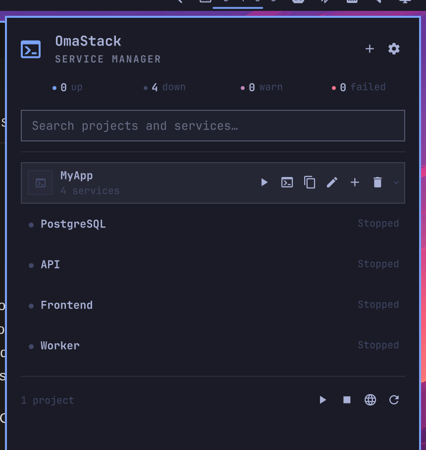
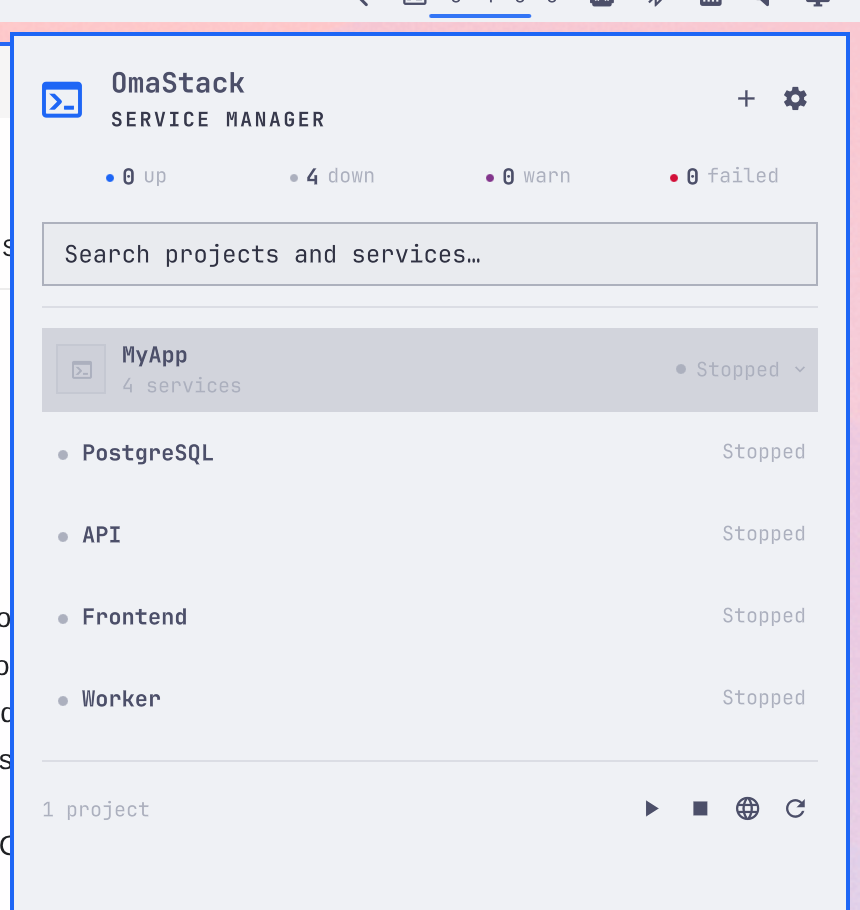

# OmaStack design review

Date: 2026-08-31

CMDHub reference: v1.0.0, commit `8e8615e1d95742ad706d52d1075e03fc2d6dab2c`

This review compares the native OmaStack implementation with the observed
CMDHub information architecture. The detailed source and screen inventory is
in [cmdhub-reference.md](cmdhub-reference.md); the feature translation is in
[cmdhub-to-omastack.md](cmdhub-to-omastack.md).

## Reference summary

CMDHub establishes a compact service-control hierarchy: global state and
search first, projects as the grouping unit, service rows as the primary work
surface, inline lifecycle controls, terse health/port/metric indicators,
bounded sparklines, and logs/editors as focused secondary views. OmaStack keeps
that proven sequence and density in an original narrow, single-column Omarchy
panel with Nerd Font glyphs, theme typography and native Quickshell controls.

The implementation does not copy CMDHub branding, artwork, wording, source,
screenshots, fonts, or macOS trade dress. The checked-in CMDHub image is a
research reference only and is not shipped as plugin UI.

## Implemented screen and component inventory

| Surface | OmaStack implementation and behaviour |
|---|---|
| Bar widget | OmaStack glyph plus optional running, stopped, unhealthy and crashed totals; click opens the anchored panel and right-click refreshes. |
| Header | Compact identity/connection line, add/settings actions, four-state summary and search. |
| Project groups | Ordered 42-unit disclosure rows with project identity, service count, aggregate state and hover/focus actions. |
| Project header | Start/stop, logs, duplicate, edit, add-service and guarded delete actions; click expands or collapses the group. |
| Service row | Status dot and label, CPU/memory pills, health, ports/URL, stop/restart/log controls and expanded CPU/memory sparklines. |
| Service states | Distinct starting, running, stopping, stopped, unhealthy and crashed labels/colours; transitions remain visible in the global summary. |
| Logs | Service or combined-project journald view, stream/timestamp labels, search, pause/resume follow, selectable text and non-destructive clear-visible. |
| Project wizard | Identity and first-service steps with executable/argument input, explicit shell warning and review. |
| Service editor | Command array, shell/Docker modes, directory, environment-file path, masked environment values, dependencies, restart/stop policy, health, route, URL and notes. |
| Routes | Every configured hostname, resolved loopback target, active/error state and one-click browser opening. |
| Settings/diagnostics | Bar-count appearance toggle, poll/history/log bounds, notifications, proxy settings, Docker/user-service diagnostics, export/import, cleanup and removal guidance. |
| Empty/loading/error/confirmation | First-project empty state, working status, disconnected/stale snapshot state, bounded error toast and destructive confirmation overlays. |

## Layout and interaction decisions

- The CMDHub popover becomes a 380-unit native Omarchy panel anchored to its top
  bar widget. It uses one disclosure stack with no permanent sidebar; populated
  panels shrink to their content and cap the scrolling service area.
- Service controls stay on the same horizontal scan line as state and metrics.
  Expanded sparklines appear in-place, preserving context rather than opening a
  separate monitoring page.
- Search filters both project and service names and `/` focuses it. Tab,
  Enter/Space and Escape follow native control behaviour.
- CPU and memory keep 60 bounded samples by default. Line/fill/grid colours come
  from the active theme, and expensive port/Docker polling slows while the
  panel is closed.
- Project colour is a small optional identity hint; semantic state always uses
  Omarchy colour roles so custom colour never carries health meaning alone.

The installed Omarchy Agents/Codex usage panel was also inspected as the local
companion-panel reference. Its 380-unit width, single scan column, compact hero
and capped height are now shared by every OmaStack surface, including logs and
editors. The four bar counts remain an
enabled-by-default setting and can be hidden independently.

## Linux, Hyprland and Omarchy differences

| CMDHub/macOS concept | OmaStack translation |
|---|---|
| Menu-bar popover | Omarchy top-bar widget plus shell-managed panel. |
| SwiftUI/AppKit | QML/Quickshell with `qs.Commons` and `qs.Ui`. |
| Child-process manager | Stable `systemd --user` template units so services survive shell reloads. |
| macOS typography/icons | Active Omarchy font and Nerd Font/Omarchy glyphs. |
| macOS panel rounding/shadow | Active Omarchy border, radius, spacing, shadow and animation roles. |
| Process/log APIs | Linux `/proc`, systemd and journald. |
| Local-domain system integration | Loopback HTTP and zero-configuration `.localhost` first; privileged resolver/trust work is deferred. |
| Terminal integration | `xdg-terminal-exec`, respecting the user's configured terminal. |

## Theme captures from the running plugin

These are real captures of the installed native panel using the same four
stopped, non-running visual fixtures. No palette was hard-coded or changed
inside OmaStack between captures.

### Everforest

### Tokyo Night

### Catppuccin Latte

The dark captures preserve compact hierarchy without excess contrast; the
light capture demonstrates that borders, subdued text, selected rows, status
counts and action controls remain legible from the theme's semantic roles.
Panel proportions and row density remain stable across all three.

## Safety-limited parity

Automatic `.test` DNS, trusted local HTTPS, certificate installation/renewal
and a privileged repair helper are not represented as complete. The current
release binds its HTTP proxy only to loopback, recommends `.localhost`, rejects
HTTPS route configuration, and performs no root operation. Docker features are
also optional and report a missing or inaccessible daemon clearly. These are
deliberate platform/safety boundaries, not simulated success states.

## Attribution

CMDHub is MIT licensed. Studying its public source permits adaptation subject to
the licence notice requirements, but OmaStack is a clean-room implementation
and contains no copied CMDHub source. The exact reference commit and licence
notice are recorded in [THIRD_PARTY_NOTICES.md](THIRD_PARTY_NOTICES.md).
